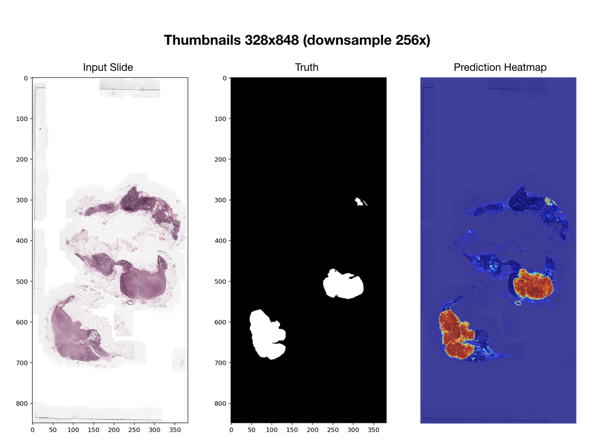

# Proof of Concept Model for Identifying Cancer Cells in H&E slide

PoC convolutional neural network that predicts per-pixel probabilty of cancer from 256x256 image tiles generated from whole-slide images.

